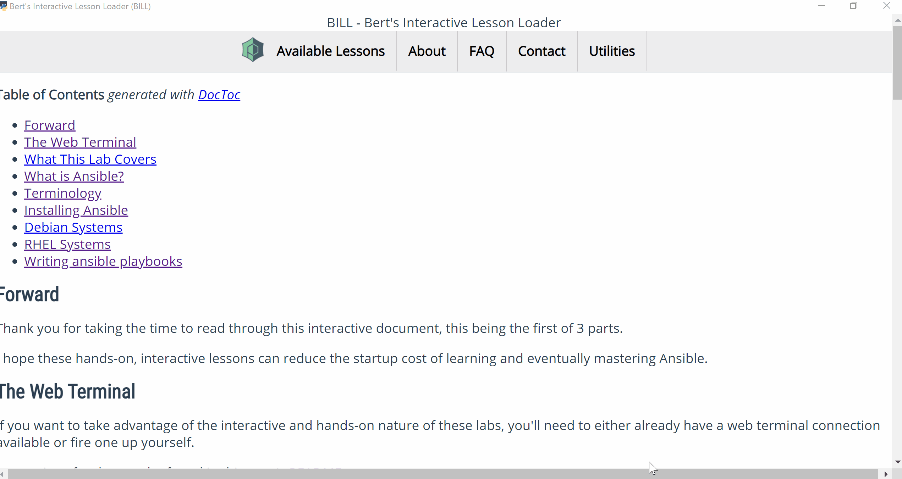

<!-- START doctoc generated TOC please keep comment here to allow auto update -->
<!-- DON'T EDIT THIS SECTION, INSTEAD RE-RUN doctoc TO UPDATE -->
**Table of Contents**  *generated with [DocToc](https://github.com/thlorenz/doctoc)*

- [BILL - Bert's Interactive Lesson Loader](#bill---berts-interactive-lesson-loader)
- [Overview](#overview)
    - [What is this and why did you make it?](#what-is-this-and-why-did-you-make-it)
    - [How did you make this?](#how-did-you-make-this)
    - [What's it look like?](#whats-it-look-like)
- [Features](#features)
- [Quick Start](#quick-start)
    - [Step 1 - Install](#step-1---install)
    - [Step 2 - Create your configuration file](#step-2---create-your-configuration-file)
    - [Step 3 - Launch!](#step-3---launch)
        - [Usage](#usage)
- [Building the app](#building-the-app)
- [Building the installer](#building-the-installer)
- [Developing the app](#developing-the-app)
- [Configuration File](#configuration-file)
    - [Configuration File - Defaults](#configuration-file---defaults)
    - [Storing credentials - OS Keyring](#storing-credentials---os-keyring)
        - [Windows](#windows)
- [Lessons](#lessons)
    - [Jinja Templating](#jinja-templating)
- [WebTerminal](#webterminal)
- [Appendix](#appendix)
    - [OS Commands](#os-commands)

<!-- END doctoc generated TOC please keep comment here to allow auto update -->

BILL - Bert's Interactive Lesson Loader
===================

<a name="top"></a>
<a name="overview"></a>
# Overview

<a name="what-is-this-and-why-did-you-make-it"></a>    
## What is this and why did you make it? 

Think [Katacoda](https://www.katacoda.com/), but instead of a website with learning examples, 
you have a desktop app that creates hands-on lessons from markdown-formatted, jina-templated documents, 
complete with a web terminal for interactive practice.

<a name="how-did-you-make-this"></a>    
## How did you make this?

The UI is written in [ReactJS](https://reactjs.org/), with 
the [Flask](https://flask.palletsprojects.com/en/2.1.x/) python package 
rendering serving up the optimized HTML assets.

<a name="whats-it-look-like"></a>    
## What's it look like?

Here's a screenshot:



Notice the menu dropdown for _Available Lessons_.
The entries are generated dynamically as defined in the app's [configuration file](configuration-file).

<a name="features"></a>
# Features

* Define your lessons catalog in a YAML-formatted configuration file, e.g. [bill.config.yaml.example](bill.config.yaml.example)
* [Lessons](#Lessons) are Markdown-formatted files
  1. First rendered as [jinja](https://jinja.palletsprojects.com/en/3.0.x/) templates
  1. Then rendered as HTML<br />
* Web-based terminals via [xtermjs](https://github.com/xtermjs/xterm.js/) component<br />
  See section on [WebTerminal](#WebTerminal)
* Interaction with OS/system is possible via underlying python process

<a name="quick-start"></a>
# Quick Start
  
<a name="step-1---install"></a>
## Step 1 - Install

**Note** that for pip installations, you'll need a minimum python version of 3.7.

You can install the app in any of the following ways:

* Download appropriate installer from the releases page
* Install pip package from pypi.org: `pip install bertdotbill`
* Install pip package from locally-cloned repo: <br />
```
git clone https://github.com/berttejeda/bert.bill.git
cd bert.bill
pip install bertdotbill .
```
* Install pip package from locally-cloned repo, in development mode: same as above, but with `pip install -e .` instead
* Install pip package directly from git repo `pip install git+http://www.github.com/berttejeda/bert.bill.git`

<a name="step-2---create-your-configuration-file"></a>
## Step 2 - Create your configuration file

Using the provided sample config [bill.config.yaml.example](bill.config.yaml.example),
create your own configuration file, ensuring the following:
- The file name is _bill.config.yaml_
- The file is located in one of the app's search paths, 
  see the section on [Configuration File](#configuration-file)

<a name="step-3---launch"></a>
## Step 3 - Launch!

* If you installed using the Windows installer from releases page, a shortcut should have been placed on your desktop.
* If installed via pip, launch the app from your terminal: `bill`
* If installed via pip as a [development instance](#step-1---install), launch via python with `python ./bertdotbill/app.py`<br />

<a name="usage"></a>
### Usage

Usage information can be obtained by invoking the executable with the `--help` flag, as with: `bill --help` or `python ./bertdotbill/app.py --help`.

The help output should be similar to:

```
usage: bill [-h] [--username USERNAME] [--password PASSWORD]
              [--lesson-url LESSON_URL]
              [--config-file CONFIG_FILE] [--config-file-templatized]
              [--no-ui] [--debug]
              [--verify-tls] [--norender-markdown]

Bert's Interactive Lesson Loader (BILL)

optional arguments:
  -h, --help            show this help message and exit
  --username USERNAME, -u USERNAME
                        Username, if the URL requires authentication
  --password PASSWORD, -p PASSWORD
                        Password, if the URL requires authentication
  --lesson-url LESSON_URL, -url LESSON_URL
                        The URL for the lesson definition
  --config-file CONFIG_FILE, -f CONFIG_FILE
                        Path to app configuration file
  --config-file-templatized, -fT
                        Render configuration via jinja2 templating
  --no-ui, -noui        Don't launch the UI
  --debug
  --verify-tls          Verify SSL cert when downloading web content
  --norender-markdown, -nomarkdown
```

<a name="building-the-app"></a>
# Building the app

* Install and configure prerequisites:
  * Python 3.7+
  * Nodejs (tested with version 16.5.0)
* Install yarn: `npm install yarn`
* Install modules: `yarn install`
* Install python prerequisites: `pip install -r requirements.txt`
* Build: `yarn build`
* Launch the development instance of the desktop app: `yarn start:gui:dev`<br />
  Under the hood, this recompiles the HTML and launches [bertdotbill/app.py](bertdotbill/app.py)

Notes for users on Windows 10 x64:
  * If you want to be able to open the Developer Console from the Desktop App, you'll need to install<br />
    [Microsoft Edge WebView2 Runtime](https://developer.microsoft.com/en-us/microsoft-edge/webview2/)
  * Ensure you configure Nodejs as per https://github.com/nodejs/node-gyp#on-windows:
      * Install the current version of Python from the Microsoft Store package.
      * Install tools and configuration manually:
      * Install Visual C++ Build Environment: Visual Studio Build Tools (using "Visual C++ build tools" workload) or Visual Studio Community (using the "Desktop development with C++" workload)
      * Launch cmd, npm config set msvs_version 2017
      * If the above steps didn't work for you, please visit Microsoft's Node.js Guidelines for Windows for additional tips.  

<a name="building-the-installer"></a>
# Building the installer

You can run `yarn build:installer` to generate the installer.

Under the hood, the above command calls the [setup.sh](setup.sh) script to do the heavy lifting.

Once the process completes, the installer file should be located in the *dist* folder.

Platform-specific notes:

- Windows: The above script calls [InnoSetup](https://jrsoftware.org/isinfo.php) against the InnoSetup script [setup.iss](setup.iss)<br />
  As such, you'll need to install [InnoSetup](https://jrsoftware.org/isinfo.php) for this to work,<br />
  Important: The [setup.sh](setup.sh) script is written in bash, so it'll only 
  work if you're on a posix emulation environment, e.g. [Cygwin](https://www.cygwin.com/), 
  [git-bash](https://git-scm.com/downloads), etc
- Linux: Not yet implemented
- OSX: Not yet implemented

[Back to Top](#top)
<a name="developing-the-app"></a>
# Developing the app

If you want to make changes to the UI, you'll need to launch the 
web instance with `yarn start:web:dev`.

Your changes to UI components will re-render the HTML on-the-fly.

<a name="configuration-file"></a>
# Configuration File

The configuration file is read by the **desktop** app , 
and is a YAML-formatted file.

As mentioned above, a sample configuration file is provided: 
[bill.config.yaml.example](bill.config.yaml.example)

The desktop app will attempt to find the config file in the 
following locations:

- Under ~/bill.config.yaml
- Adjacent to the app, i.e. in the same folder as the app's script
- Under ~/.bill/bill.config.yaml
- Under /etc/bill.config.yaml

Do review the comments in the sample file, as these explain how the sections are interpreted/handled by the UI.

<a name="configuration-file---defaults"></a>
## Configuration File - Defaults

If no settings can be found, the app will resort to its defaults, 
see [defaults.py](bertdotbill/defaults.py#L18-L36) 

As such, the defaults settings call for the import of an external config, hosted in my [bert.lessons](https://github.com/berttejeda/bert.lessons) repo: <br />
see [bert.lessons/bill.config.yaml](https://raw.githubusercontent.com/berttejeda/bert.lessons/main/bill.config.yaml)

This external config is where I am listing all of my (mostly) hand-crafted tutorials and learning materials.

<a name="lessons"></a>
# Lessons

As already mentioned, lessons are Markdown-formatted 
files interpreted as [jinja](https://jinja.palletsprojects.com/en/3.0.x/) 
templates.

You can define a lesson catalog in the 
[configuration file](bill.config.yaml.example#L33-L57).

If these files are stored in a password-protected web location, 
you'll need to specify credentials in the auth.global section 
of the config file.

Per-lesson credentials are not yet implemented, but will 
be in a future version.

<a name="jinja-templating"></a>
## Jinja Templating

To add to the templating goodies provided by the Jinja library,
I've exposed the OS Environment via the _environment_ key of 
the _sessions_ object.

This means you should be able to reference any OS-level environment 
variable in your lesson content, e.g. 

```markdown
# Overview

Hello {{ session['environment']['USERNAME'] }}, welcome to Lesson 1
```

<a name="webterminal"></a>
# WebTerminal

Every lesson rendered through the app includes a web-based terminal 
emulator component that allows for practicing the lesson material.

These web terminals are embedded in the user interface, 
available at its footer and as a slide-in from the right 
(click Utils to reveal).

As mentioned before, the underlying technology for these web 
terminals is [xterm.js](https://github.com/xtermjs/xterm.js/).

As such, the xterm.js component requires a websocket to a bash process.

By [default](bertdotbill/defaults.py), the bert.bill desktop app 
will attempt to connect to a local instance of the websocket via _http://127.0.0.1:5000/_.

You can get this websocket running either by:

- Running the pre-built docker image: `docker run --rm -it --name aiohttp -p 5000:5000 berttejeda/aiohttp-websocket-bash`
- Running the pre-built docker image above via the Web UI (click _Utilities_, then _Launch Local Web Terminal_)
- Launching the bash+websocket script yourself: https://github.com/berttejeda/bert.docker/blob/master/shared/start-bash-websocket.py<br />
  Note: The script will only work on a POSIX OS

Either of the commands above will start the websocket 
and bash process on the target platform on port 5000 by default.

Feel free to adjust either approach to your need, 
e.g. change the listening port, but be aware that the desktop app's 
[configuration file](bill.config.yaml.example) must be adjusted to 
reflect any changes to the way the websocket is accessed.

# Appendix

## OS Commands

You can define commands that can be launched from the Top 
Navigation bar of the UI. 

These commands are defined in the _commands_ section of the config file, 
see [bill.config.yaml.example](bill.config.yaml.example#L21-L34).

Any defined commands will appear under the _Utilities_ 
dropdown menu of the Top Navigation bar, as illustrated below:


*Note* that you'll also have to define Allowed Command Patterns 
(Regular Expressions), as exemplified in the 
[config file](bill.config.yaml.example#L21-L23)

Any commands that do not match any of the regular expressions will 
be denied execution.

Read more on Python Regular Expression syntax: 
https://docs.python.org/3/library/re.html
